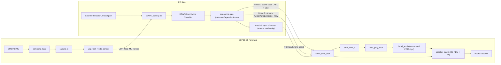

# Action Detector

ESP32-C5 firmware and PC tools for motion/action detection using the
ESP-SensairShuttle (BMI270 IMU). The device samples IMU data, timestamps it,
and streams frames over UDP to a host for capture and analysis.

## Contents
- `firmware/` ESP-IDF firmware (Wi-Fi + UDP streaming, BMI270 sampling)
- `pc/` Host-side utilities (receiver/analysis)
- `scripts/` Small helper scripts (e.g., UDP listener)
- `docs/` Project docs (capture + labeling workflow)

## System Architecture

## Status
Bring-up complete: I2C/BMI270 verified, UDP streaming verified, basic receiver
working.

Current empirical status (2026-02-08):

- `swipe_left` / `swipe_right`: online recognition is mostly reliable after
  trigger-based capture and offline model loading.
- `idle`: still not stable enough (false `unknown` / occasional confusion).
- Startup latency: improved by moving threshold calibration offline
  (`build_model.py`), then loading prebuilt model at runtime.

## Next Milestone Support
Trajectory capture + labeling workflow skeleton is now in place:

- Workflow document: `docs/data_capture_labeling.md`
- Labeled capture tool: `pc/capture_labeled.py`
- DTW baseline classifier: `pc/dtw_baseline.py`
- Offline model builder: `pc/build_model.py`
- Live UDP classifier demo: `pc/live_classify.py`
- Action label voice output:
  - Streamed PCM TTS: `pc/live_classify.py --tts-enable`
  - Board-local clip playback (recommended): `pc/live_classify.py --tts-enable --tts-output-mode board-local`
  - Board-local clip assets: `firmware/main/audio_labels/*.pcm`
- Complex action strategy (design only): `docs/complex_action_strategy.md`
